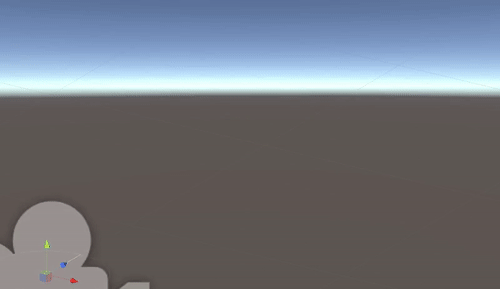

# Tunnels

Unlike 2D web-pages which require scrollbars to navigate, `Tunnels` explores ways to use depth information to traverse paginated content in 3D. By separating content into discrete layers staggered in Z-axis space, we can reveal content as we walk towards it.

See a video of it in action [here](https://vimeo.com/261965823)

If you're interested in trying it out, open the project in Unity 2017 and build the `tunnelMain` scene to iOS. You will need a beta version of XCode 9 as well as an ARKit compatible iPhone with iOS 11 or newer. 
